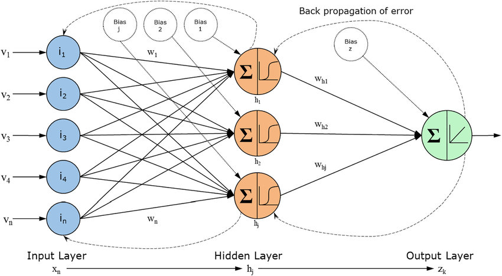
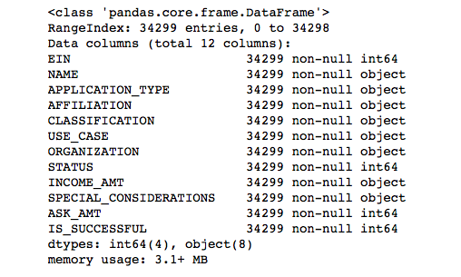
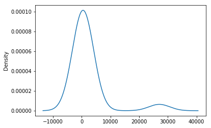
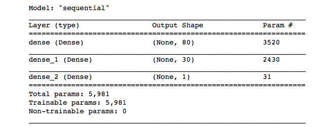
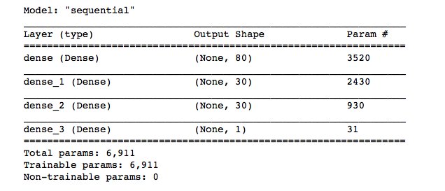

# Neural Network Charity Analysis

[Module 3](https://trilogyed.instructure.com/courses/626/pages/3-dot-0-1-the-rise-of-machine-learning?module_item_id=32093) is focused on creating and optimizing a neural network machine learning algorithm to determine which non-profit organization to invest in.

A **neural network** (also known as the **artificial neural networks** or **ANN**) are a set of algorithms that are modeled after the human brain. They are an advanced form of machine learning that recognizes patterns and features in input data and provides a clear quantitative output.



*Workflow diagram of the artificial neural network*

## Analysis

From the CSV file containing more than 34,000 organizations that received funding form Alphabet Soup over the years, the following metadata about each organization have been captured

* **EIN** and **NAME** — Identification columns
* **APPLICATION_TYPE** — Alphabet Soup application type
* ** AFFILIATION** — Affiliated sector of industry
* **CLASSIFICATION** — Government organization classification
* **USE_CASE** — Use case for funding
* **ORGANIZATION** — Organization type
* **STATUS** — Active status
* **INCOME_AMT** — Income classification
* **SPECIAL_CONSIDERATIONS** — Special consideration for application
* **ASK_AMT** — Funding amount requested
* **IS_SUCCESSFUL** — Was the money used effectively

### Deliverable 1: Preprocessing Data for a Neural Network Model (30 points)

Starting the Analysis from the DataFrame, `application_df`, below,



#### Drop unnecessary columns

Since the **EIN** and the **NAME** are indentifying columns, they will not provide generalizable patterns and thus and not effective for machine learning. Thus, they were dropped from `application_df`

```python
# Drop the non-beneficial ID columns, 'EIN' and 'NAME'.
application_df = application_df.drop(columns=['EIN', 'NAME'])
```

#### Addressing categorical columns

The prior image also highlights the fact that many of the columns contain categorical data (`object`). The evaluate this preprocessing step, the amount of unique values associated within each column is evaluated:

```python
# Determine the number of unique values in each column.
application_df.nunique()
```

Then a density plot per categorical column is plotted to determine the cutoff point to bin all uncommon unique values



This process is repeated for all (`object`) columns with a unique categorical count of greater than 10. Which means APPLICATION_TYPE and CLASSIFICATION.

#### One Hot Encoding

The categorical data across object columns are then encoded using a one-hot (also known as **one-of-K scheme**) encoder. Fortunately, [scikit-learn](https://scikit-learn.org/stable/) is flexible enough to perform all of the one-hot encodings at the same time.

```python
# Create a OneHotEncoder instance
enc = OneHotEncoder(sparse=False)

# Fit and transform the OneHotEncoder using the categorical variable list
# application_cat_lt_10 = set(s[s].index) - set(application_cat_gr_10)
encode_df = pd.DataFrame(enc.fit_transform(application_df[application_cat]))

# Add the encoded variable names to the dataframe
encode_df.columns = enc.get_feature_names(application_cat)
encode_df.head()
```

The encoded DataFrame, `encode_df`, is merged to the original DatFrame, `application_df`, then the original columns are dropped. Ensuring that all columns are of a numerical datatype.

```python
# Merge one-hot encoded features and drop the originals
application_df = application_df.merge(encode_df, left_index=True, right_index=True)
application_df = application_df.drop(application_cat, 1)
application_df.head()
```

#### Train/Test split and Scaling

Finally, the dataset is split

```python
# Split our preprocessed data into our features and target arrays
y = application_df["IS_SUCCESSFUL"].values
X = application_df.drop(["IS_SUCCESSFUL"], 1).values

# Split the preprocessed data into a training and testing dataset
X_train, X_test, y_train, y_test = train_test_split(X, y, random_state=1)
```

and scaled with the scikit-learn standard scaler

```python
# Create a StandardScaler instances
scaler = StandardScaler()

# Fit the StandardScaler
X_scaler = scaler.fit(X_train)

# Scale the data
X_train_scaled = X_scaler.transform(X_train)
X_test_scaled = X_scaler.transform(X_test)
```

### Deliverable 2: Compile, Train, and Evaluate the Model (20 points)

A deep neural network with 2 hidden layers is defined (see the table below).

| Layer | Nodes | Activatioin Func |
| ----- | ----- | ---------------- |
| Input Layer | # of Input Features | N/A
| Hidden Layer 1 | 80 | relu |
| Hidden Layer 2 | 30 | relu |
| Output Layer | 1 | sigmoid |



### Deliverable 3: Optimize the Model (20 points)

To optimize the previously defined neural network, a third hidden layer was added (see the table below).

| Layer | Nodes | Activatioin Func |
| ----- | ----- | ---------------- |
| Input Layer | # of Input Features | N/A
| Hidden Layer 1 | 80 | relu |
| Hidden Layer 2 | 30 | relu |
| Hidden Layer 3 | 30 | relu |
| Output Layer | 1 | sigmoid |



## Results

### Neural Network

268/268 - 0s - loss: 0.6915 - accuracy: 0.5292
Loss: 0.691472589969635, Accuracy: 0.5292128324508667

### Optimized Neural Network

268/268 - 0s - loss: 0.5524 - accuracy: 0.7254
Loss: 0.5524417161941528, Accuracy: 0.7253644466400146

## Summary

From the Result, it is clear that the extra added hidden layer improve the network accurary by 20. Meaning that the 3 layer model is a better network setup.

## References

Zafeiris, Dimitrios & Rutella, Sergio & Ball, Graham. (2018). An Artificial Neural Network Integrated Pipeline for Biomarker Discovery Using Alzheimer's Disease as a Case Study. Computational and Structural Biotechnology Journal. 16. 10.1016/j.csbj.2018.02.001. 
